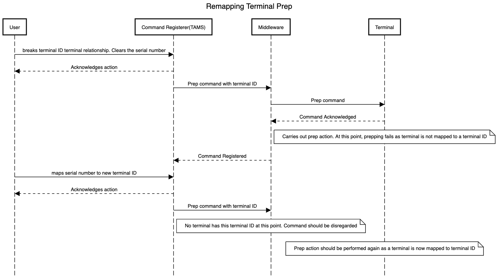
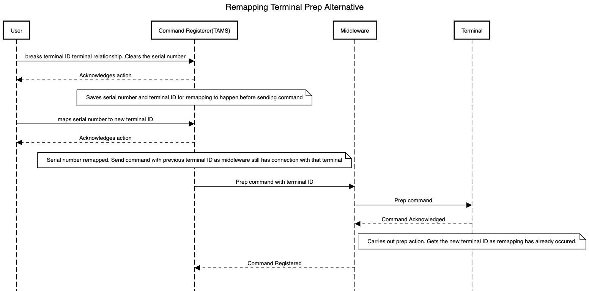

# AUTO PREP

## Single terminal prep

A single terminal is affected.

Middleware gets the prep command from event registerer (Web client) and forwards the message to the terminal.

## Remapping terminal prep

Two terminal IDs will be affected here.

User breaks the relationship between terminal and terminal ID, clears the serial number. At this point, if we use only terminal ID to identify the terminal to send commands to. The terminal will recieve the prep command and attempt to prep. Due to the terminal ID not linked to a serial number, the prep attempt will fail.

Next, the terminal is re-mapped. If the Terminal ID remapped to is new, no terminal is using the terminal ID, the command has no destination and is lost. Middleware, at this point, should disregard the command.

## Remapping terminal prep Alternative

TAMS could save the serial number and terminal ID after a relationship is broken, then wait for that serial number to be re-mapped before sending the command.

## Remapping terminal prep remap to used terminal ID

When a terminal wants to map to a terminal ID being used, more like an exchange of terminal IDs, the alternative option would be helpful.
TAMS sends the initial command to the command mapped and saves a new record for the bounced terminal. The record include serial number and the terminal ID mapped to.

After re-mapping the terminal, TAMS sends the prep command using the saved terminal ID.

